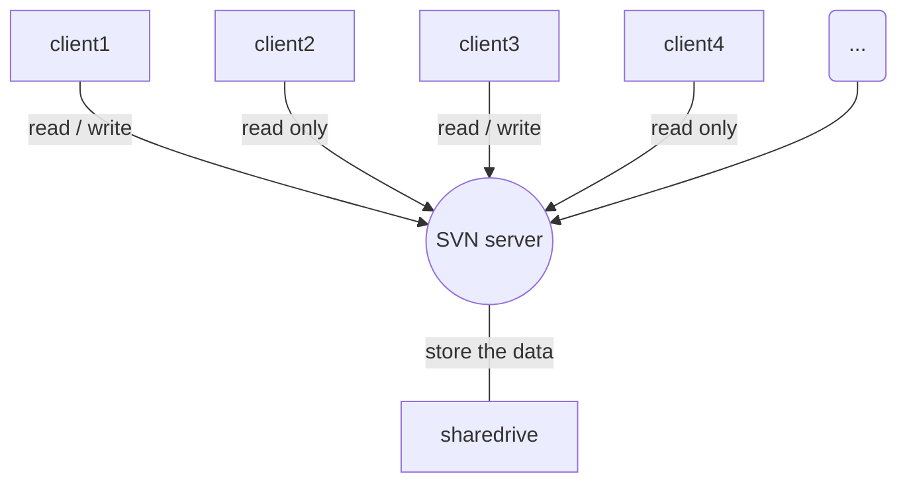

# cana-android
帕金森 标定板

```mermaid
graph TD
    client1-->|read / write|SVN((SVN server))
    client2-->|read only|SVN
    client3-->|read / write|SVN
    client4-->|read only|SVN
    client5(...)-->SVN
    SVN---|store the data|sharedrive
```
